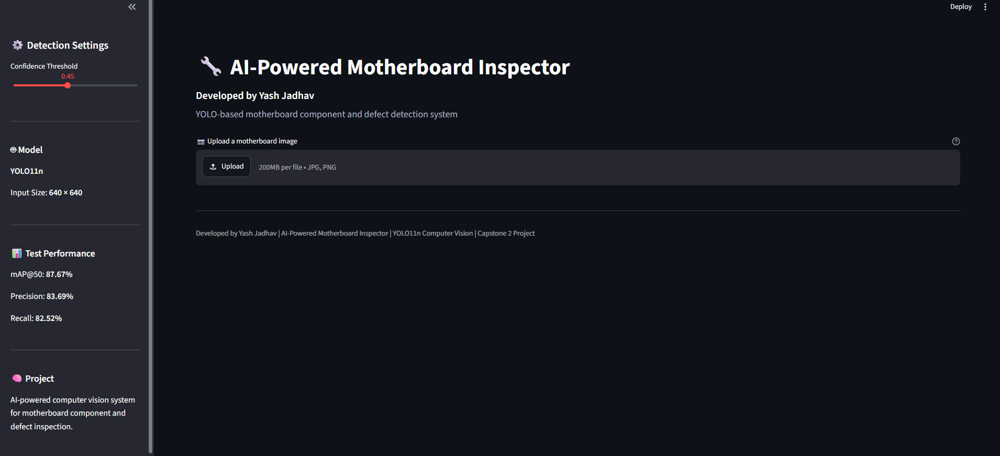
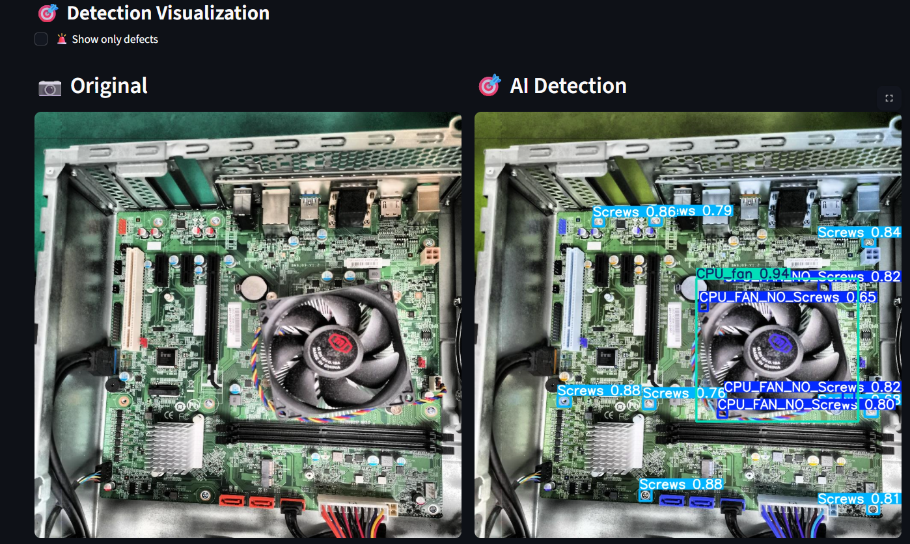
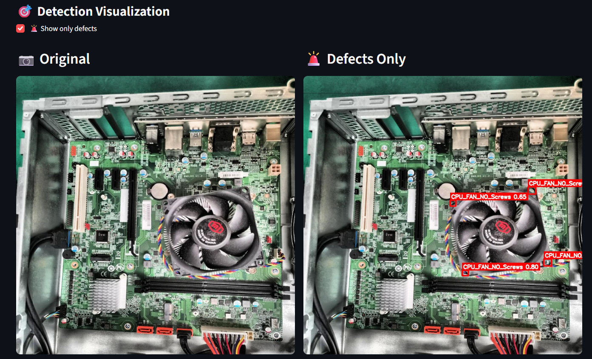
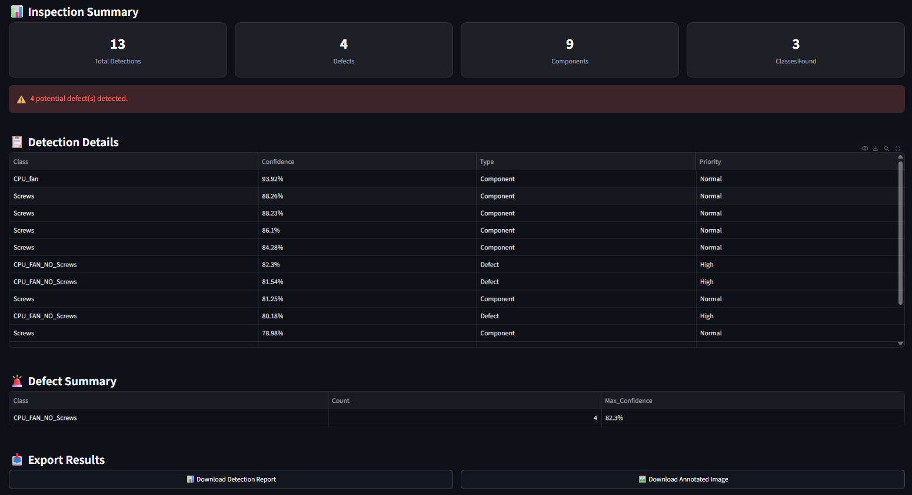

# 🔧 AI-Powered Motherboard Defect Detection

An AI-based computer vision system that detects motherboard components and manufacturing defects using **YOLO11n**. The project provides a user-friendly **Streamlit web application** for uploading motherboard images and receiving real-time AI-based inspection results.

## 🚀 Project Overview

Manual inspection of PCBs and motherboards can be time-consuming and prone to human error.

This project uses deep learning-based object detection to automatically identify motherboard components and detect common manufacturing defects such as:

- Missing screws
- Loose screws
- Incorrect screws
- Detached CPU fan ports
- Missing CPU fan screws
- Scratches

The trained model is integrated into a Streamlit application that displays detections, confidence scores, defect summaries, and downloadable inspection reports.

## 🎯 Objectives

- Automate motherboard visual inspection
- Detect components and manufacturing defects
- Reduce dependency on manual inspection
- Provide real-time AI predictions
- Generate a simple inspection report
- Demonstrate an end-to-end Computer Vision workflow

## 🧠 Technology Stack

- Python
- YOLO11n
- Ultralytics
- OpenCV
- Streamlit
- NumPy
- Pandas
- Matplotlib
- Seaborn

## 📊 Dataset

The project uses a publicly available motherboard production defect dataset.

### Dataset Split

| Dataset | Images |
|---|---:|
| Training | 939 |
| Validation | 31 |
| Testing | 45 |
| Total | 1,015 |

The dataset contains **11 object classes**.

### Classes

1. CPU_FAN_NO_Screws
2. CPU_FAN_Screw_loose
3. CPU_FAN_Screws
4. CPU_fan
5. CPU_fan_port
6. CPU_fan_port_detached
7. Incorrect_Screws
8. Loose_Screws
9. No_Screws
10. Scratch
11. Screws

## 🏗️ Project Architecture

```text
Input Motherboard Image
          ↓
     YOLO11n Model
          ↓
    Object Detection
          ↓
 ┌───────────────────┐
 │ Components        │
 │ Defects           │
 └───────────────────┘
          ↓
 Confidence Filtering
          ↓
 Streamlit Dashboard
          ↓
 Detection Results
          ↓
 CSV / Annotated Image

```
## 📸 Application Screenshots

### 🖥️ Streamlit Dashboard



### 🔍 AI Detection Results



### 🚨 Defects-Only Visualization



### 📊 Inspection Summary



## 🚀 Live Demo

👉 [Try the AI Motherboard Inspector](https://ai-motherboard-inspector-by-yash.streamlit.app/)
